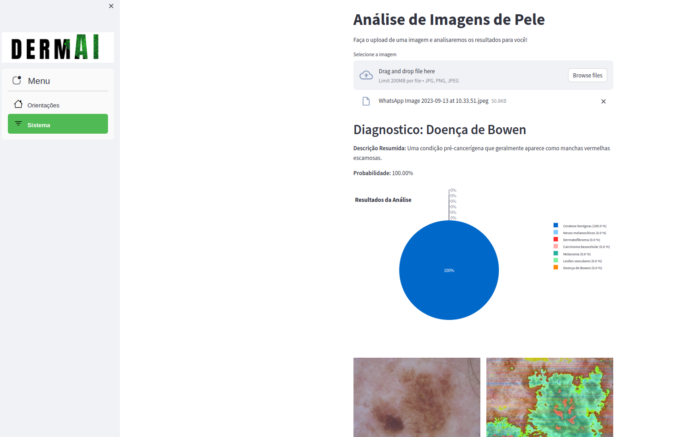

# Classificador de Lesões de Pele

Este projeto foi desenvolvido como o projeto final de um MBA em Machine Learning e se concentra na classificação de lesões de pele em 7 tipos diferentes: eratoses actínicas e carcinoma intraepitelial / doença de Bowen (akiec), carcinoma basocelular (bcc), lesões tipo ceratose benignas (lentigos solares/ceratoses seborreicas e ceratoses tipo líquen plano, bkl), dermatofibroma (df), melanoma (mel), nevos melanocíticos (nv) e lesões vasculares (angiomas, angioqueratomas, granulomas piogênicos e hemorragias, vasc).

## Base de Dados

Os dados para este projeto foram obtidos a partir de duas fontes:

1. [Repositório no GitHub](https://github.com/ptschandl/HAM10000_dataset): Este repositório contém os arquivos originais do conjunto de dados, incluindo imagens e metadados.

2. [Conjunto de Dados no Kaggle](https://www.kaggle.com/datasets/smnuruzzaman/skin-cancer-datase): Este conjunto de dados complementar foi usado para enriquecer a variedade de imagens disponíveis.

Todo o material utilizado no projeto, desde os arquivos originais até o modelo treinado, está disponível neste repositório do GitHub. Isso inclui os códigos-fonte, notebooks Jupyter, scripts de pré-processamento de dados, modelos treinados e muito mais.

Sinta-se à vontade para explorar e contribuir para este projeto. Se tiver alguma dúvida ou precisar de mais informações, entre em contato conosco.

# Sistema




# Como Importar Requisitos de um Arquivo YAML no Conda e Iniciar o sistema

O Conda é uma ferramenta poderosa para gerenciamento de ambientes e pacotes em Python. Se você tem um arquivo YAML chamado "requisitos.yml" que contém uma lista de pacotes e versões, você pode usar o Conda para criar um novo ambiente com essas dependências.

Aqui estão os passos para importar os requisitos de um arquivo YAML no Conda:

## Passo 1: Abra o Terminal ou Prompt de Comando

Abra um terminal ou prompt de comando no seu sistema operacional. Certifique-se de que o Conda esteja instalado e que você esteja usando o ambiente apropriado (ou crie um novo ambiente, se necessário).

## Passo 2: Navegue até o Diretório do Arquivo YAML

Use o comando `cd` para navegar até o diretório onde o arquivo "requisitos.yml" está localizado. Certifique-se de estar no diretório correto antes de prosseguir.

## Passo 3: Crie um Novo Ambiente Conda

Para criar um novo ambiente Conda com base nas especificações do arquivo YAML, use o seguinte comando:

```
conda env create -f requisitos.yml
```

## Passo 4: Ative o Novo Ambiente

Após criar o novo ambiente, você pode ativá-lo utilizando o seguinte comando:

```
conda activate skincancer
```
## Passo 5: Inicie o sistema

Aposta ativar o ambiente conda novo, navegue até o repositório clona do git pelo terminal e digite o comando:

```
streamlit run programa.py
```
### Contatos:
[](eng.arthurpaschoalotto@gmail.com)
[](https://www.linkedin.com/in/arthur-paschoalotto-488839174/)
[](https://www.instagram.com/paschoalothur/)
